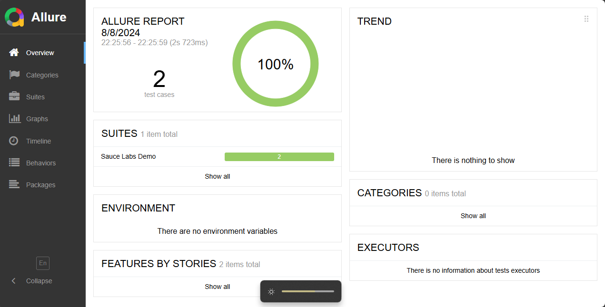

# Selenium JS Automation Project

Proyek Pengujian Otomatisasi ini menggunakan Selenium WebDriver, JavaScript, dan Allure Report, dengan konsep Page Object Model.

Proyek ini mengimplementasikan pengujian otomatis untuk aplikasi web menggunakan Selenium WebDriver sebagai framework pengujian berbasis Page Object Model (POM), JavaScript untuk bahasa pemrograman, dan Allure untuk pelaporan.

## Tujuan Proyek
- Mengelola dan menjalankan pengujian otomatis untuk fungsional fitur pada aplikasi web.
- Memastikan bahwa aplikasi berperilaku sesuai dengan spesifikasi dalam berbagai skenario.

## Struktur Proyek
- `pages/` = Folder untuk file Page Object Model, termasuk `Login.js` dan `Home.js`
- `test/` = Folder untuk file pengujian
- `hooks.js` = File untuk setup dan teardown WebDriver
- `package.json` = File konfigurasi npm dan skrip
- `package-lock.json` = File yang mencatat versi persis dari dependensi

## Instalasi
Untuk menginstal semua dependensi yang diperlukan, jalankan perintah berikut:
```sh
npm install
```

## Run Test
Untuk menjalankan semua test yang diperlukan, jalankan perintah berikut:
```sh
npm test
```


## Generate Allure report
Untuk menyimpan semua test ke dalam reporter allure, jalankan perintah berikut:
```sh
npx allure generate allure-results --clean -o allure-report
```
setelah itu untuk membuka reporter, jalankan perintah berikut:
```sh
npx allure open allure-report
```

## Allure Report
 - 


